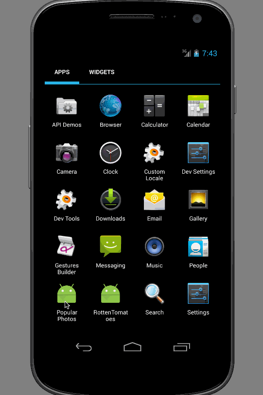

# Week 1 Project: Instagram Photo Viewer

This is an Android demo application for displaying the popular photos from Instagram.

Time spent: 8 hours spent in total

Completed user stories:

For each photo displayed user can see the following details
 * [x] Required: Graphic, Caption, Username.
 * [x] Optional: Relative timestamp, Like count, User profile image.
 * [x] Advanced: Add pull-to-refresh for popular stream with SwipeRefreshLayout
 * [x] Advanced: Show latest comment for each photo (bonus: show last 2 comments)
 * [x] Advanced: Display each photo with the same style and proportions as the real Instagram (see screens below)
 * [ ] Advanced: Display each user profile image using a RoundedImageView
 * [ ] Advanced: Display a nice default placeholder graphic for each image during loading (read more about Picasso)
 * [x] Advanced: Improve the user interface through styling and coloring
 * [ ] Bonus: Allow user to view all comments for an image within a separate activity or dialog fragment
 * [ ] Bonus: Allow video posts to be played in full-screen using the VideoView
 * [x] Optional: Hide Action Bar when scrolling down

## Acknowledgements

This project uses the [Instagram API](https://instagram.com/developer/).

It also uses many other open source libraries such as:

 * [Android Async HTTP](https://github.com/loopj/android-async-http)
 * [Picasso](http://square.github.io/picasso/)

## Walkthrough of all user stories:

GIF created with [LiceCap](http://www.cockos.com/licecap/).
